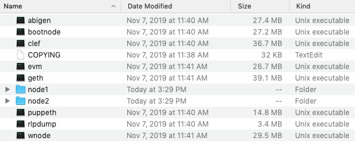

# Assignment #18 - Blockchain  <br /> 

In this project, I will create a testnet blockchain network for an imaginary company. <br />
Below are the steps of this assignment:
- Set up a custom testnet blockchain
- Send a transaction
- Create a repo
- Write instructions on how to use the chain for the rest of the team

In order to set up a testnet, I will need to use the following tools we covered in FinTech bootcamp;
- Puppeth, to generate the genesis block
- Geth, a command-line tool, to create keys, initialize nodes, and connect nodes together
- The clique proof of authority algorithm

# 1. Blockchain Installation Guide <br />
***Installing MyCrypto Desktop App***

MyCrypto is a free, open-source, client-side interface that allows for interacting directly with the blockchain. <br />
For this example, we will use MyCrypto Desktop App to manage ethereum wallets and make transactions in the blockchain. <br />
To install MyCrypto Desktop App, please follow the next steps:

- Open the browser and navigate to https://download.mycrypto.com/.

- Once you download the installer, open the file, and follow the installation wizard.

***Installing Go Ethereum Tools***

Go Ethereum is one of the three original implementations of the Ethereum protocol. It is written in Go, fully open-source and licensed under the GNU LGPL v3. ​

In this example, we will use Go Ethereum Tools to create our very own blockchain, from the genesis block to mining tokens and making transactions. ​

To install the Go Ethereum Tools, please follow the next steps: ​

- Open the browser and navigate to the Go Ethereum Tools download page at https://geth.ethereum.org/downloads/ ​

- Scroll down to the "Stable Releases" section and proceed depending on your operating system.​ Click on the ***Geth & Tools 1.9.7*** to download the applications bundle archive. ​

- After downloading the tools archive, open my "Downloads" folder, and you will find a file named geth-alltools-darwin-amd64-1.9.7-a718daa6.tar.gz in OS X, and a file called geth-alltools-windows-amd64-1.9.7-a718daa6.zip in Windows.

- Decompress the archive in the location of your preference in your computer's hard drive, and rename the containing folder as Blockchain-Tools. I recommend using a location that can be easily accessed from the terminal window like the user's home directory.

<<<<<<< HEAD
- You have finished the installation process; you will use these tools to create my very own blockchain! 

# 2. Instructions for POA Blockchain Transactions <br />
***Creating nodes***
1. Add an empty directory for nodes in unzipped folder
```
mkdir node1 node2
```
Your folder will look like this: 

2. Get new accounts numbers from nodes to use as signers
```
./geth account new --datadir node1
./geth account new --datadir node2
```
3. The system will ask for passwords, after writing passwords for each node, save them for later use.
```
echo 'node1pass' > node1/password.txt
echo 'node2pass' > node2/password.txt
```

